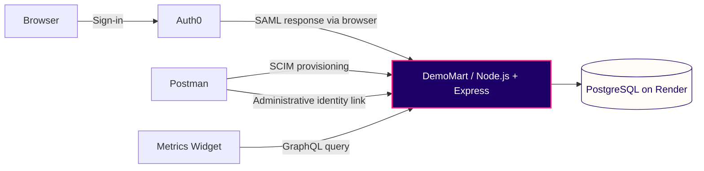

<div align="center">

# 🛒 DemoMart
### Team Portal

Employee identity, access and account lifecycle for a fictional retail company.

[Open portal](https://storeops-identity-lab.onrender.com/) · [View metrics](https://storeops-identity-lab.onrender.com/metrics) · [Documentation](docs/README.md)

**SAML SSO · SCIM provisioning · GraphQL metrics**

</div>

---

## Overview

DemoMart connects employee sign-in, account provisioning and access management in one small retail application. Employees authenticate through Auth0; administrators manage accounts through APIs; a metrics widget reflects the current account state.

Built with plain JavaScript, Express, HTML and CSS, with PostgreSQL for hosted storage.

## What it does

| Capability | Behavior |
| --- | --- |
| **Single sign-on** | Validates signed SAML responses from Auth0. |
| **Two onboarding paths** | Creates accounts on first authorized login with JIT, or provisions them in advance through SCIM. |
| **Identity linking** | Associates an Auth0 identity with an existing SCIM account while preserving its ID and profile. |
| **Access lifecycle** | Updates store assignments and blocks protected access for inactive accounts. |
| **Live account metrics** | Serves selected aggregate fields through a read-only GraphQL API. |
| **Activity visibility** | Shows login stages in the browser and API outcomes in structured server logs. |

## Architecture



Postman acts as the provisioning client. Auth0 authenticates users; the application database owns provisioned account state. PostgreSQL retains accounts across application redeploys, while sessions remain in memory.

## Explore

- **[Portal](https://storeops-identity-lab.onrender.com/)** — SSO entry point for assigned test accounts.
- **[Metrics](https://storeops-identity-lab.onrender.com/metrics)** — aggregate user counts and store distribution.
- **[Login activity](https://storeops-identity-lab.onrender.com/activity)** — open in the same browser context as sign-in to follow backend events.

Authentication requires an assigned Auth0 account. Provisioning and identity linking require separate API credentials.

## Run locally

Requires **Node.js 24+** and **pnpm**.

```sh
pnpm install --frozen-lockfile
node scripts/setup.mjs
pnpm start
```

Open [localhost:3000](http://localhost:3000). Configure SSO using the [Auth0 guide](docs/AUTH0-SETUP.md). Local storage defaults to SQLite; set `DATABASE_URL` to use PostgreSQL.

Run `pnpm test` for the automated suite; signed SAML tests also require OpenSSL.

## Documentation

[Solution overview](docs/SOLUTION-OVERVIEW.md) · [SSO](docs/AUTH0-SETUP.md) · [SCIM](docs/SCIM-FIRST-EXERCISE.md) · [Identity linking](docs/ADMIN-LINK-API.md) · [GraphQL](docs/GRAPHQL-METRICS.md) · [Deployment](docs/POSTGRESQL.md)

## Project scope

DemoMart is an independent reference project using fictional retail data. It implements a SCIM subset and read-only GraphQL; Auth0 user assignment is manual, and automatic IdP provisioning is not configured. Metrics are public aggregates, and sessions reset on restart. See the [solution overview](docs/SOLUTION-OVERVIEW.md) for implementation boundaries.

The repository, hosting address and protocol identifiers retain their original `storeops` names for compatibility.
