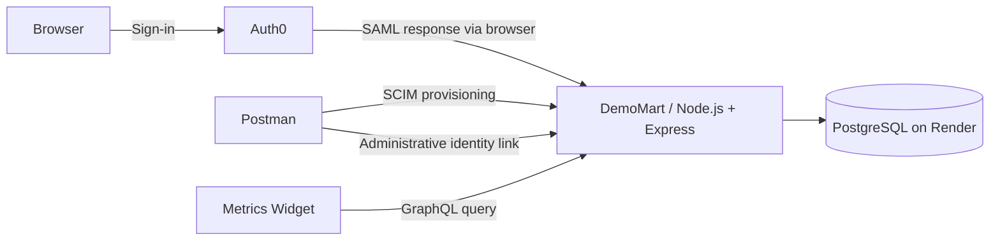

# DemoMart — Team Portal

A hands-on technical implementation case study for a fictional retail customer: provision a store employee, connect their identity, enable SSO, revoke access, and verify the outcome through API responses, logs, and a metrics widget.

Built as an interview demonstration for a customer-facing integrations role. This is an independent learning project, not an official Zipline product or integration.

DemoMart is the fictional retail brand used throughout the portal. The repository name, hosted URL, SAML identifiers, environment keys and database names retain their original technical values for configuration compatibility.

**[Open the hosted demo](https://storeops-identity-lab.onrender.com/)** · **[Metrics Widget](https://storeops-identity-lab.onrender.com/metrics)** · **[Demo walkthrough](docs/INTERVIEW-DEMO.md)**

The presenter provides a test account for the guided session. Creating an Auth0 account alone does not grant DemoMart access.

## Customer scenario

A retail organization needs employees assigned to the correct store, a central sign-in experience, and a reliable way to remove access when an employee leaves.

The implementation separates three responsibilities:

| Responsibility | Implementation |
| --- | --- |
| Authentication: who is signing in? | Auth0 sends a signed SAML response; DemoMart validates it. |
| Provisioning: which account, store and access status should exist? | A SCIM API creates and updates accounts. Postman simulates the customer's provisioning client. |
| Reporting: what is the current account state? | A GraphQL API reads aggregate database metrics for a browser widget. |

Two onboarding paths are supported: JIT creates an account on its first authorized SAML login; SCIM creates an account before login, followed by an explicit administrative link to its Auth0 identity.

## Architecture



The frontend uses HTML, CSS and browser JavaScript. The backend uses Express, Node-SAML, GraphQL.js and the PostgreSQL driver. Local development can use SQLite; the hosted application uses a separate PostgreSQL service selected through `DATABASE_URL`.

## Guided demonstration · 5–7 minutes

| Step | Action | Evidence |
| --- | --- | --- |
| 1. Provision | Create a fictional user with `POST /scim/v2/Users`. | HTTP 201 and a new account ID, before any login. |
| 2. Prepare identity | Create the corresponding Auth0 user and set authorized `app_metadata`. | Auth0 User ID and store assignment, configured by the presenter. |
| 3. Link | Send the SCIM account ID and Auth0 User ID to `POST /api/admin/identity-links`. | HTTP 200; the existing account ID is preserved. |
| 4. Authenticate | Sign in through Auth0 in a private browser window. | Dashboard shows **SCIM account preserved — SAML sign-in**. |
| 5. Revoke | PATCH the SCIM account to `active: false`, then refresh the dashboard. | Access is blocked; the Metrics Widget reflects the inactive account. |
| 6. Restore | PATCH `active: true` and verify access again. | The same account becomes usable again. |
| 7. Query | Request only `activeUsers`, then request an unknown field. | GraphQL selects the requested field and rejects the invalid query. |

Open [Login Activity](https://storeops-identity-lab.onrender.com/activity) in a second tab of the **same browser session** before signing in. It shows the backend login stages. SCIM and administrative API events appear in server logs.

## API examples

Postman environments keep local and hosted values separate. Set `baseUrl`, `scimToken`, `adminToken`, `userId` and `auth0UserId` for the selected environment.

### Link an existing SCIM account

```http
POST {{baseUrl}}/api/admin/identity-links
Authorization: Bearer {{adminToken}}
Content-Type: application/json
```

```json
{
  "userId": "{{userId}}",
  "subject": "{{auth0UserId}}"
}
```

This custom administrative operation is separate from SCIM. It requires a distinct admin credential and uses the server's trusted issuer. Repeating an identical link succeeds; conflicting links and silent account merges are refused. The administrator confirms that both IDs belong to the intended person.

### Select metrics with GraphQL

```http
POST {{baseUrl}}/api/graphql
Content-Type: application/json
```

```json
{
  "query": "{ metrics { activeUsers usersByStore { storeId users } } }"
}
```

Available fields: `totalUsers`, `activeUsers`, `inactiveUsers`, and `usersByStore { storeId users }`. The schema controls allowed queries; the resolver reads the database. Field selection controls the response, not which aggregate SQL calculations run.

## Implementation decisions

- **Stable identity:** accounts are identified by issuer and subject, not automatically matched by email.
- **Clear ownership:** SAML authenticates a linked SCIM account without overwriting its profile, store or active status.
- **Atomic provisioning:** account and SCIM representation changes commit together or roll back together.
- **Access checks:** inactive accounts are rejected at login and when accessing the protected dashboard.
- **Protocol validation:** signed SAML assertions are checked for issuer, audience, timing, recipient and request correlation; completion is browser-bound and single-use.
- **Observability:** structured events explain success and failure without logging passwords, tokens, cookies or raw assertions.
- **Separate persistence:** restarting the application clears sessions, while PostgreSQL retains accounts independently of the web service.

## Run locally

Requires Node.js 24+, pnpm, and OpenSSL for signed SAML tests.

```sh
pnpm install --frozen-lockfile
node scripts/setup.mjs
pnpm check
pnpm test
pnpm start
```

Open [localhost:3000](http://localhost:3000). Setup creates `.env` from `.env.example` if needed. Configure Auth0 before testing SSO. Leave `DATABASE_URL` empty to use local SQLite.

For the hosted demo, `render.yaml` describes the web service. Configure environment variables in Render; the Auth0 callback must match the public application URL. See [PostgreSQL setup](docs/POSTGRESQL.md). Neither credentials nor database contents belong in the repository.

## Verification and scope

Automated tests cover signed SAML success and rejection paths, JIT behavior, SCIM provisioning and rollback, administrative authorization and linking, and GraphQL selection and validation. PostgreSQL SQL tests use the embedded PGlite engine; they do not verify Render connectivity or Auth0 configuration.

The guided hosted flow has also been manually exercised: SCIM creation, administrative linking, SAML sign-in, deactivation/reactivation, and GraphQL queries. Before presenting, confirm the test account is active and GET the same account after a redeploy to check persistence.

This is a focused demonstration, not a production-ready identity platform:

- Postman simulates provisioning; automatic IdP-to-SCIM synchronization is not implemented.
- Auth0 account creation and access metadata are manual.
- SCIM supports a subset: create, read, limited filtering/pagination, and PATCH replace of active status or store.
- Sessions, login traces and request state are in memory in one process. Logout ends the DemoMart session, not the Auth0 session. Reactivation can restore an unexpired local session.
- Metrics expose aggregate lab counts publicly. They are not scoped to the signed-in user's store.
- GraphQL is read-only; there are no mutations or subscriptions.
- Free hosting has availability and retention limits. Export demo data before the database's scheduled expiry.

## Code map and walkthroughs

| File | Purpose |
| --- | --- |
| [src/server.js](src/server.js) | Select storage and start the server. |
| [src/config.js](src/config.js) | Configure SAML trust and callback values. |
| [src/app.js](src/app.js) | Handle login, sessions, dashboard and route registration. |
| [src/scim.js](src/scim.js) | Validate provisioning requests. |
| [src/admin.js](src/admin.js) | Authorize and process identity links. |
| [src/postgres.js](src/postgres.js) | PostgreSQL storage and transactions. |
| [src/identity.js](src/identity.js) / [src/sqlite-scim.js](src/sqlite-scim.js) | Local SQLite account and provisioning storage. |
| [src/metrics-graphql.js](src/metrics-graphql.js) | Define the GraphQL schema and resolver. |
| [public/metrics.js](public/metrics.js) / [views/metrics.html](views/metrics.html) | Fetch metrics and display the widget. |
| [test/](test/) | Automated behavioral checks. |

Implementation references: [documentation index](docs/README.md), [SCIM provisioning](docs/SCIM-FIRST-EXERCISE.md), [administrative linking](docs/ADMIN-LINK-API.md), [GraphQL metrics](docs/GRAPHQL-METRICS.md), and [SAML SSO configuration](docs/AUTH0-SETUP.md).
